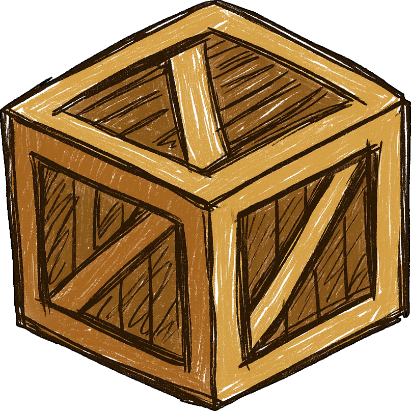

<h1> Crates</h1>

Lightweight crate unboxing system for Minecraft Beta 1.7.3<br/>
Configurable weighted rewards, rarity tiers, and Discord integration.


---

## 🧭 Features

### Core Crates
- Players open crates by spending virtual keys
- Weighted reward rolls using integer weights
- Cosmetic rarity tiers: `COMMON`, `UNCOMMON`, `RARE`, `EPIC`, `LEGENDARY`
- Adjustable crate open delay *(in ticks)*

### Player Experience
- Paged **preview menu** to inspect configured rewards
- Optional roulette-style spin animation
- Subtle particle and sound effects during opening
- Audio cues for crate actions and key handling

### Administration
- Command suite for managing keys and configuration
- View, set, or distribute keys to all online players
- Reload configuration without server restarts

### Logging & Integrations
- Optional Discord webhook integration with detailed embeds
- In-game server-wide broadcasts for EPIC and LEGENDARY opened rewards

---

## 🤝 Contributing
Contributions, issues, and suggestions are welcome.  
Refer to the [CONTRIBUTING guide](https://github.com/AleksandarHaralanov/Crates/blob/master/.github/CONTRIBUTING.md) before submitting changes.

To report bugs or request features, use the [GitHub Issues page](https://github.com/AleksandarHaralanov/Crates/issues).

---

## ⬇️ Download
The latest release is available on the [Releases page](https://github.com/AleksandarHaralanov/Crates/releases/latest).  
For extra assurance, you can verify the `.jar` file using [VirusTotal](https://www.virustotal.com/gui/home/upload).

---

## 🔗 Requirements
Compatible with:
- [CraftBukkit 1060](https://github.com/AleksandarHaralanov/Crates/raw/refs/heads/master/libs/craftbukkit-1060.jar)
- [Project Poseidon](https://github.com/retromcorg/Project-Poseidon)
- [UberBukkit](https://github.com/Moresteck/Project-Poseidon-Uberbukkit)

**Softdepend:** WorldGuard

---

## 🪄 Usage
By default, only server operators have permission.  
Use a permissions plugin such as **PermissionsEx** to grant access to specific groups.

### Commands
| Command                              | Permission               | Description                                    |
|--------------------------------------|--------------------------|------------------------------------------------|
| `/crates`                            | `crates.use`             | Displays Crates help/about menu.               |
| `/crates reload`                     | `crates.config`          | Reloads the Crates configuration.              |
| `/crates delay <ticks>`              | `crates.config`          | Sets crate open delay (20 ticks = 1 second).   |
| `/crates keys`                       | `crates.keys.view`       | Shows your current crate key count.            |
| `/crates keys <player>`              | `crates.keys.view.other` | View another player's crate key count.         |
| `/crates keys set <player> <amount>` | `crates.keys.set`        | Set a specific player’s key amount.            |
| `/crates keys giveall <amount>`      | `crates.keys.giveall`    | Give keys to all online players.               |

**Aliases:** `/crate`, `/crs`

### Permissions
| Permission               | Default | Description                                     |
|--------------------------|---------|-------------------------------------------------|
| `crates.*`               | `op`    | Grants all Crates permissions.                  |
| `crates.use`             | `true`  | Allows viewing the main Crates help/about menu. |
| `crates.open`            | `true`  | Allows opening crates.                          |
| `crates.config`          | `op`    | Allows reloading config and setting open delay. |
| `crates.keys.*`          | `op`    | Grants all key-related permissions.             |
| `crates.keys.view`       | `true`  | Allows viewing your own key count.              |
| `crates.keys.view.other` | `op`    | Allows viewing another player’s key count.      |
| `crates.keys.set`        | `op`    | Allows setting a player’s key count.            |
| `crates.keys.giveall`    | `op`    | Allows giving keys to all online players.       |

---

## 📦 Configuration
The plugin generates a configuration file in the **Crates** directory on first run.  
It defines webhook settings, crate open behavior, and reward data.

### `config.yml`
```yaml
# ==========================================================
# Crates Configuration
# ----------------------------------------------------------
# crate-open-delay:   Delay before opening (20 ticks = 1s)
# roulette-animation: Toggle roulette spin effect
#
# webhook:
#   enabled:     Enable Discord webhook notifications
#   url:         Webhook endpoint (replace with your URL)
#   avatar-api:  Player avatar URL (%player% = username)
#
# Each reward requires:
#   id:      Item ID (e.g. "35:3" = light blue wool)
#   amount:  Quantity of the item
#   weight:  Chance weight (higher = more common)
#   tier:    Cosmetic rarity (COMMON → LEGENDARY)
# ==========================================================

webhook:
  enabled: false
  url: "INSERT_WEBHOOK_URL"
  avatar-api: "https://minotar.net/avatar/%player%.png"

crate-open-delay: 20
roulette-animation: true

rewards:
  - id: "1"
    amount: 5
    weight: 5
    tier: COMMON

  - id: "2"
    amount: 4
    weight: 4
    tier: UNCOMMON

  - id: "3"
    amount: 3
    weight: 3
    tier: RARE

  - id: "4"
    amount: 2
    weight: 2
    tier: EPIC

  - id: "5"
    amount: 1
    weight: 1
    tier: LEGENDARY
```

> [!NOTE]
> **Weights:** Each reward's `weight` adds to the total pool; higher values increase selection likelihood.  
> **Tiers:** Cosmetic only — probabilities depend solely on weights.

---

## 📊 Project Statistics

